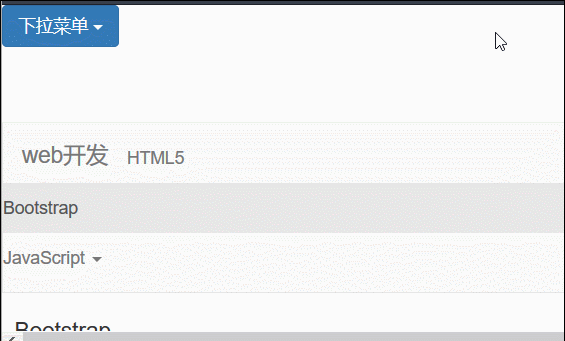
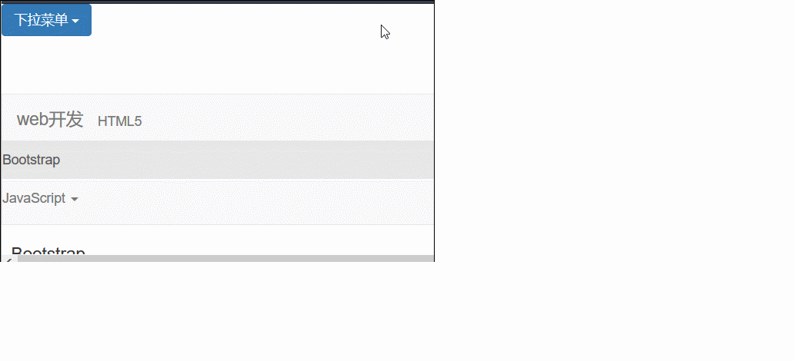

## 1.下拉菜单 ##
常规使用时，和组件方法一样

	

		<!-- data-toggle="dropdown" data-target="#dropdown" -->
		<button class="btn btn-primary" data-toggle="dropdown" data-target="#btn" >
			下拉菜单
			
		</button>
		<ul class="dropdown-menu">
			<li><a href="#">首页</a></li>
			<li><a href="#">资讯</a></li>
			<li><a href="#">产品</a></li>
			<li><a href="#">关于</a></li>
		</ul>
	

声明式用法的核心  
1. 外围容器使用 class="dropdown"包裹   
2. 内部点击按钮事件绑定 data-toggle="dropdown"    
3. 菜单元素使用 class="dropdown-menu"   

如果按钮在容器外部，可以使用data-toggle进行绑定   

下拉菜单支持4种事件，分别对应弹出前，弹出后，关闭前和关闭后

	$('#btn').on('show.bs.dropdown',function(){
		alert('调用show方法时执行');
	});

样式：  

## 2.滚动监听 ##

	<nav class="navbar navbar-default" id="nav">
		<a href="#" class="navbar-brand">web开发</a>
		<ul class="nav navbar-nav">
			<li><a href="#html5">HTML5</a></li>
			<li><a href="#bootstrap">Bootstrap</a></li>
			<li class="dropdown">
				<a href="#" data-toggle="dropdown">JavaScript </a>
				<ul class="dropdown-menu">
					<li><a href="#jquery">JQuery</a></li>
					<li><a href="#yui">Yui</a></li>
					<li><a href="#extjs">ExtJS</a></li>
				</ul>
			</li>
		</ul>
	</nav>
	

		<section class="sec">
			<h4 id="html5">HTML5 <a href="#" onclick="removeSec(this);">删除</a></h4>
			
标准通用标记语言下的一个应用HTML 标准自1999 年12 月发布的HTML4.01后，后继的HTML5 和其它标准被束之高阁，为了推动Web 标准化运动的发展，一些公司联合起来，成立了一个叫做Web Hypertext Application Technology Working Group（Web 超文本应用技术工作组-WHATWG） 的组织。WHATWG 致力于Web 表单和应用程序，
			而W3C（World Wide Web Consortium，万维网联盟） 专注于XHTML2.0。在2006 年，双方决定进行合作，来创建一个新版本的HTML。

		</section>
		<section class="sec">
			<h4 id="bootstrap">Bootstrap</h4>
			
Bootstrap，来自Twitter，是目前很受欢迎的前端框架。Bootstrap 是基于HTML、CSS、JAVASCRIPT 的，它简洁灵活，使得Web 开发更加快捷。[1] 它由Twitter
			的设计师Mark Otto 和Jacob Thornton 合作开发，是一个CSS/HTML 框架。Bootstrap提供了优雅的HTML 和CSS 规范，它即是由动态CSS 语言Less 写成。Bootstrap 一经推出
			后颇受欢迎，一直是GitHub 上的热门开源项目，包括NASA 的MSNBC（微软全国广播公司）的Breaking News 都使用了该项目。[2] 国内一些移动开发者较为熟悉的框架，如WeX5
			前端开源框架等，也是基于Bootstrap 源码进行性能优化而来。[3] 

		</section>
		<section class="sec">
			<h4 id="jquery">jQuery</h4>
			
JQuery 是继prototype 之后又一个优秀的Javascript 库。它是轻量级的js库，它兼容CSS3，还兼容各种浏览器（IE 6.0+, FF 1.5+, Safari 2.0+, Opera 9.0+），
			jQuery2.0 及后续版本将不再支持IE6/7/8 浏览器。jQuery 使用户能更方便地处理HTML（标准通用标记语言下的一个应用）、events、实现动画效果，并且方便地为网站提供AJAX
			交互。jQuery 还有一个比较大的优势是，它的文档说明很全，而且各种应用也说得很详细，同时还有许多成熟的插件可供选择。jQuery 能够使用户的html 页面保持代码和html 内容
			分离，也就是说，不用再在html 里面插入一堆js 来调用命令了，只需要定义id 即可。

		</section>
		<section class="sec">
			<h4 id="yui">Yui</h4>
			
近几年随着jQuery、Ext 以及CSS3 的发展，以Bootstrap 为代表的前端开发框架如雨后春笋般挤入视野，可谓应接不暇。不论是桌面浏览器端还是移动端都涌现出很多优秀的框架，极大丰富了开发素材，也方便了大家的开发。这些框架各有特点，本文对这些框架进行初步的介绍与比较，希望能够为大家选择框架提供一点帮助，也为后续详细研究这些框架的抛砖引玉。

		</section>
		<section class="sec">
			<h4 id="extjs">Extjs</h4>
			
ExtJS 可以用来开发RIA 也即富客户端的AJAX 应用，是一个用javascript写的，主要用于创建前端用户界面，是一个与后台技术无关的前端ajax 框架。因此，可以把ExtJS 用在.Net、Java、Php 等各种开发语言开发的应用中。ExtJs 最开始基于YUI 技术，由开发人员JackSlocum 开发，通过参考JavaSwing 等机制来组织可视化组件，无论从UI 界面上CSS 样式的应用，到数据解析上

		</section>
	

这里有两个重要的属性，  

data-offset  默认值为10，固定内容距离滚动容器10px内。就高亮显示所对应的菜单  
data-spy 设置scroll，将设置滚动容器监听  
data-target 设置#nav,绑定指定监听的菜单。

滚动监听事件还有一个切换到新条目的事件 
 
	$("#nav").on('activate.bs.scrollspy',function(){
		alert('新条目被激活');
	});

滚动监听还有一个更新容器DOM的方法   
删除内容时，刷新一下容器，避免导航监听错位

	function removeSec(e){
		$(e).parents('.sec').remove();
		$('#content').scrollspy('refresh');
	}

样式  
