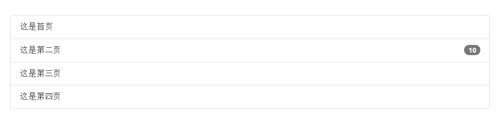
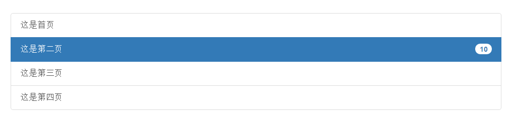
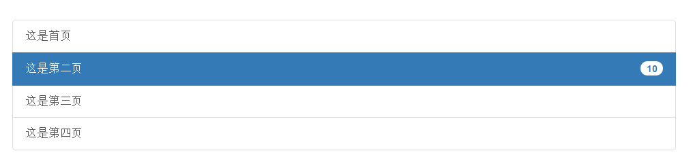
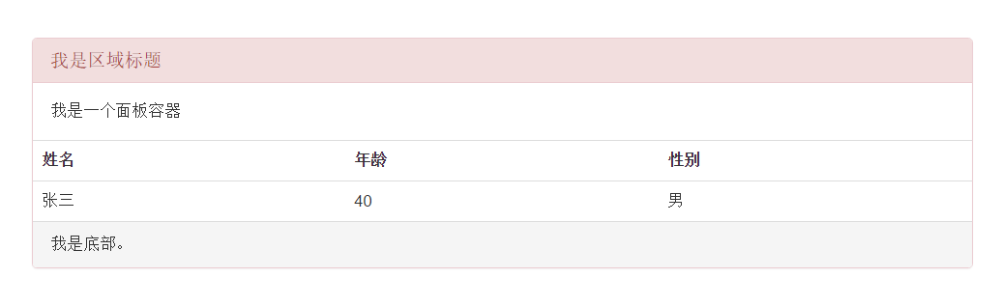
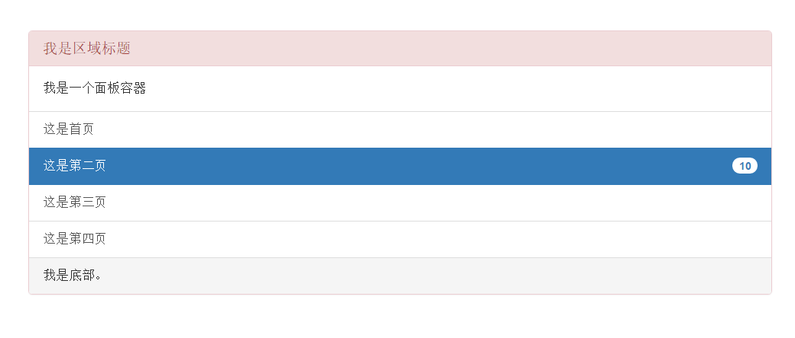

## 1.列表组组件 ##

	<ul class="list-group">
		<li class="list-group-item">这是首页</li>
		<li class="list-group-item">这是第二页10</li>
		<li class="list-group-item">这是第三页</li>
		<li class="list-group-item">这是第四页</li>
	</ul>

链接

	

		<a href="#" class="list-group-item">这是首页</a>
		<a href="#" class="list-group-item active">这是第二页10</a>
		<a href="#" class="list-group-item">这是第三页</a>
		<a href="#" class="list-group-item">这是第四页</a>
	
	

按钮

	<ul class="list-group">
		<button class="list-group-item">这是首页</button>
		<button class="list-group-item active">这是第二页10</button>
		<button class="list-group-item">这是第三页</button>
		<button class="list-group-item">这是第四页</button>
	</ul>

## 2.面板组件 ##
面板组件是一个存放内容的容器组件

表格类面板

	

		

			<h3 class="panel-title">我是区域标题</h3>
		

		
我是一个面板容器

		<table class="table">
			<tr>
				<th>姓名</th>
				<th>年龄</th>
				<th>性别</th>
			</tr>
			<tr>
				<td>张三</td>
				<td>40</td>
				<td>男</td>
			</tr>
		</table>	
		

			我是底部。
		

	

列表类面板

	

		

			<h3 class="panel-title">我是区域标题</h3>
		

		
我是一个面板容器

		<ul class="list-group">
		<button class="list-group-item">这是首页</button>
		<button class="list-group-item active">这是第二页10</button>
		<button class="list-group-item">这是第三页</button>
		<button class="list-group-item">这是第四页</button>
	</ul>
		

			我是底部。
		

	

## 3.响应式嵌入组件 ##
根据被嵌入内容的外部容器的宽度，自动创建一个固定的比例，从而让浏览器确定内容的尺寸，能够社设备上缩放。  
这些规则可以直接用于iframe,embed,video和object元素。

	

	<iframe frameborder="no" border="0" marginwidth="0" marginheight="0" width=330 height=86 src="//music.163.com/outchain/player?type=2&id=28815250&auto=1&height=66"></iframe>
	
