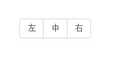
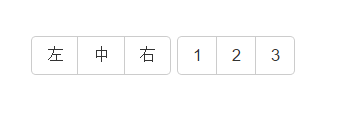
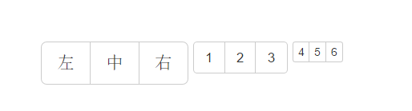
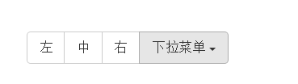
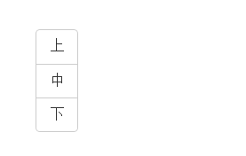
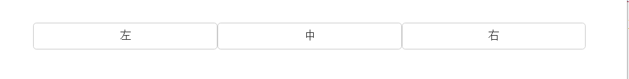

按钮组件就是多个按钮集成在一个容器里形成独有的效果。
## 基本格式 ##

	

		<button class="btn btn-default">左</button>
		<button class="btn btn-default">中</button>
		<button class="btn btn-default">右</button>
	

样式    

## 将多个按钮组整合起来方便管理 ##

	

		

			<button class="btn btn-default">左</button>
			<button class="btn btn-default">中</button>
			<button class="btn btn-default">右</button>
		

		

			<button class="btn btn-default">1</button>
			<button class="btn btn-default">2</button>
			<button class="btn btn-default">3</button>
		

	

样式;   
  

## 设置按钮组大小 ##

	

		

			<button class="btn btn-default">左</button>
			<button class="btn btn-default">中</button>
			<button class="btn btn-default">右</button>
		

		

			<button class="btn btn-default">1</button>
			<button class="btn btn-default">2</button>
			<button class="btn btn-default">3</button>
		

		

			<button class="btn btn-default">4</button>
			<button class="btn btn-default">5</button>
			<button class="btn btn-default">6</button>
		

	

样式：

## 嵌套一个分组，比如下拉菜单 ##

	

		<button class="btn btn-default">左</button>
		<button class="btn btn-default">中</button>
		<button class="btn btn-default">右</button>
		

			<button class="btn btn-default dropdown-toggle" data-toggle="dropdown">
				下拉菜单
				
			</button>
			<ul class="dropdown-menu">
				<li class="dropdown-header">网站导航</li>
				<li><a href="#">首页</a></li>
				<li><a href="#">资讯</a></li>
				<li><a href="#">产品</a></li>
				<li class="divider"><a href="#">产品</a></li>
				<li class="disabled"><a href="#">关于</a></li>
			</ul>
		

	

样式   

## 设置垂直按钮组 ##

	

		<a href="#" class="btn btn-default">上</a>
		<a href="#" class="btn btn-default">中</a>
		<a href="#" class="btn btn-default">下</a>
	

样式   

## 设置两端对齐按钮 ##

使用<a\>标签  

	

		<a href="#" class="btn btn-default">左</a>
		<a href="#" class="btn btn-default">中</a>
		<a href="#" class="btn btn-default">右</a>
	

样式   
