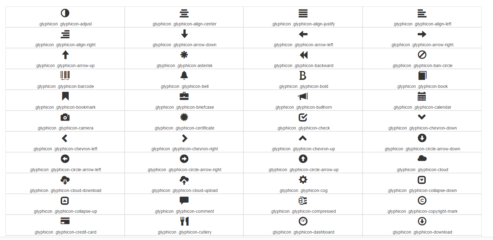
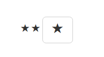
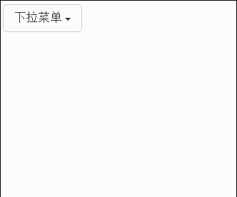

## 1.小图标组件 ##
bootstrap提供了小图标。

所有图标	请访问[bootstrap](http://www.runoob.com/try/demo_source/bootstrap3-glyph-icons.htm "bootstrap图标")

可以使用<i\>或者span标签配合使用

	<i class="glyphicon glyphicon-star"></i>
	

也可以结合按钮

	<button class="btn btn-default btn-lg">
		<i class="glyphicon glyphicon-star"></i>
	</button>

样式：   

## 2.下拉菜单组件 ##
下拉菜单，就是点击一个元素或者按钮，出发隐藏的列表显示出来。

	

		<button class="btn btn-default" data-toggle="dropdown">
			下拉菜单
			
		</button>
		<ul class="dropdown-menu">
			<li class="dropdown-header">网站导航</li>
			<li><a href="#">首页</a></li>
			<li><a href="#">资讯</a></li>
			<li><a href="#">产品</a></li>
			<li class="divider"><a href="#">产品</a></li>
			<li class="disabled"><a href="#">关于</a></li>
		</ul>
	

按钮和菜单都要包裹在.dropdown中，而作为被点击的元素按钮需要设置data-toggle="dropdown".对于菜单部分，设置class="dropdown-menu"才能自动隐藏并添加固定样式。设置class="caret"表示箭头。  
设置向上触发 

	
  

菜单项居右对齐，默认是dropdown-menu-left

	<ul class="dropdown-menu dropdown-menu-right">

设置菜单的标题，不要加超链接

	<li class="dropdown-header">网站名称</li>

设置菜单的分割线

	<li class="divider"><a href="#">产品</a></li>

设置菜单的禁用项

	<li class="disabled"><a href="#">关于</a></li>

样式：

