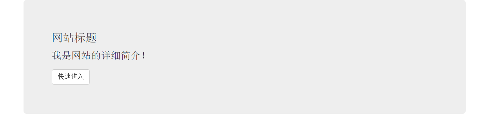
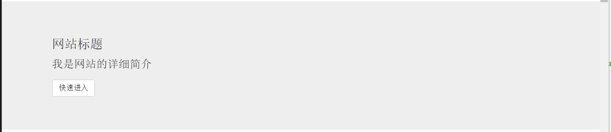
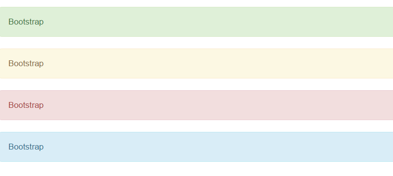

## 1.巨幕组件 ##
在固定的范围内，有圆角。

	

		

			<h3>网站标题</h3>
			
我是网站的详细简介！

			
<a href="#" class="btn btn-default">快速进入</a>

		

	

样式   

100%全屏，没有圆角

	

		

			<h3>网站标题</h3>
			
我是网站的详细简介

			
<a href="#" class="btn btn-default">快速进入</a>

		

	

样式      
   

 
## 2.页头组件 ##
增加一些空间

	

		<h1>我是大标题<small>我是小标题</small></h1>
	

样式      
   

 
## 3.缩略图组件 ##
缩略图配合响应式

	

		

			

				

					
					

						<h3>图片</h3>
						
关于这张图的详情

						
<a href="#" class="btn btn-default">快速进入</a>

					

				

			

			

				

					
					

						<h3>图片</h3>
						
关于这张图的详情

						
<a href="#" class="btn btn-default">快速进入</a>

					

				

			

			

				

					
					

						<h3>图片</h3>
						
关于这张图的详情

						
<a href="#" class="btn btn-default">快速进入</a>

					

				

			

			

				

					
					

						<h3>图片</h3>
						
关于这张图的详情

						
<a href="#" class="btn btn-default">快速进入</a>

					

				

			

		

	

样式      
   

 
## 4.警告框组件 ##
基本警告框

	
Bootstrap

	
Bootstrap

	
Bootstrap

	
Bootstrap

样式      
   

 
带关闭的警告框

	

		请到<a href="#" class="alert-link">官网下载</a>
		<button class="close" data-dismiss="alert">
			&times;
		</button>
	

样式      
   

 
