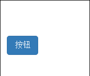
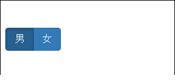
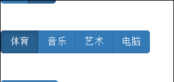
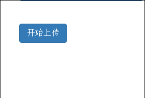

## 按钮 ##
可以通过按钮创建不同状态的按钮   
单个切换

	<button class="btn btn-primary" data-toggle="button">按钮</button>

样式  

单选按钮

	

		<label for="" class="btn btn-primary active">
			<input type="radio" name="sex" value="男" checked="checked">男
		</label>
		<label for="" class="btn btn-primary">
			<input type="radio" name="sex" value="女">女
		</label>
	

复选按钮

	

		<label for="" class="btn btn-primary active">
			<input type="checkbox" name="fa" value="体育" checked="checked">体育
		</label>
		<label for="" class="btn btn-primary">
			<input type="checkbox" name="fa" value="音乐">音乐
		</label>
		<label for="" class="btn btn-primary">
			<input type="checkbox" name="fa" value="艺术">艺术
		</label>
		<label for="" class="btn btn-primary">
			<input type="checkbox" name="fa" value="电脑">电脑
		</label>
	

加载状态

	<button class="btn btn-primary" data-loading-text="loading...." autocomplete="off" id="btn">开始上传</button>
	

