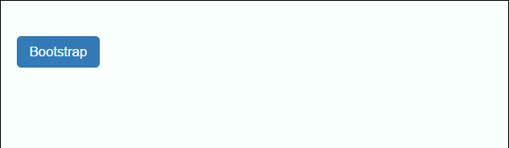
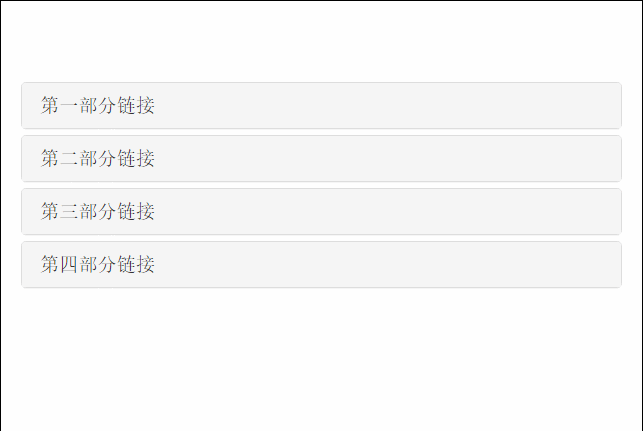

## 折叠 ##
通过点击可以折叠内容

	<button class="btn btn-primary" data-toggle="collapse" data-target="#content">
		Bootstrap
	</button>
	

		
bootstrap是有Twitter公司推出的一个用于前端开发的开源工具包。

	

手风琴折叠

	

		

			

				<h4 class="panel-title">
					<a href="#collapseOne" data-toggle="collapse" data-parent="#accordion">第一部分链接</a>
				</h4>
			

			

				

					第一部分内容
				

			

		

		

		

			

				<h4 class="panel-title">
					<a href="#collapseTwo" data-toggle="collapse" data-parent="#accordion">第二部分链接</a>
				</h4>	
			

			

				

					第二部分内容
				

			

		

		

		

			

				<h4 class="panel-title">
					<a href="#collapseThree" data-toggle="collapse" data-parent="#accordion">第三部分链接</a>
				</h4>	
			

			

				

					第三部分内容
				

			

		

		

		

			

				<h4 class="panel-title">
					<a href="#collapseFour" data-toggle="collapse" data-parent="#accordion">第四部分链接</a>
				</h4>	
			

			

				

					第四部分内容
				

			

		
	
	

折叠中的事件

	