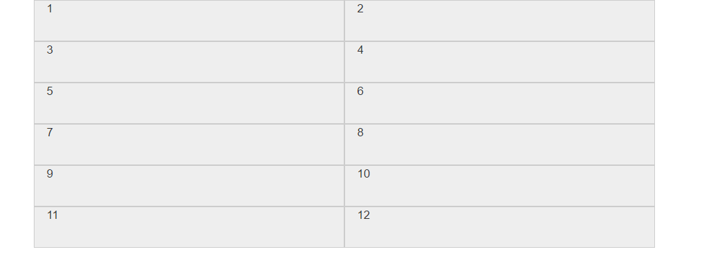
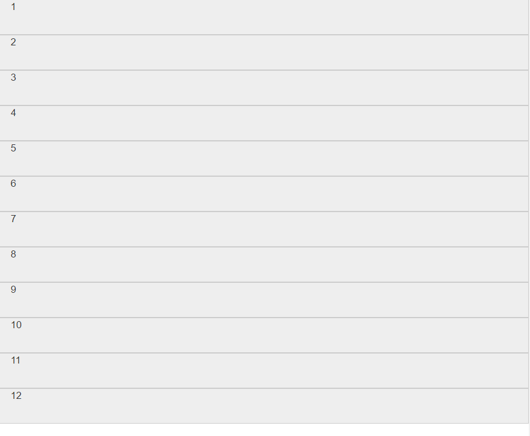

## 一、移动设备优化 ##
在html5中，有一个非常重要的meta,用于设置屏幕和设备等宽以及是否允许用户缩放，以及缩放比例问题。  
分别为：屏幕宽度和设备一致，初始缩放比例，最大缩放比例和禁止用户缩放。

	<meta name="viewport" content="width=device-width, initial-scale=1,maximum-scale=1, user-scalable=no">

## 二、布局容器 ##
bootstrap需要为页面内容和栅格系统包裹一个.container容器，由于padding等属性原因，这种容器不能相互嵌套。  
固定宽度

	

100%宽度

	

栅格系统中，浏览器会随着屏幕的大小的增减自动分配12列，通过一系列的行(row)与列(column)的组合来创建页面布局。工作原理如下：  
1. 行必须包含在.container(固定宽度)或者.container-fluid中，以便于为其赋予合适的排列(aligment)和内补(padding).  
2. 通过行(row)在水平方向创建一组列(column).  
3. 你的内容应当放置于列内，并且，只有"列(column)"可以作为行(row)的直接子元素。  
4. 类似.row和.col-xs-4这种预定义的类，可以快速创建栅格布局。  
5. 通过列(column)设置padding属性，从而创建列与列之间的间隔(gutter);通过.row元素设置负值margin从而抵消掉.container元素设置的padding。也就间接为行所包含的列抵消掉了padding。   
6. 负值的margin就是下面的实例为什么是向外突出的原因。在栅格列中的内容排成一行。  
7. 栅格系统中的列是通过指定1到12的值来表示其跨越的范围。  
8. 如果一行中包含的列大于12，多余的列所在的元素将会作为一个整体另起一行排列。   
9. 栅格类适用于与屏幕宽度大于或等于分界点大小的设备，并且针对小屏幕设备覆盖栅格类。因此，在元素上应用任何.col-md-*栅格类适用于与屏幕宽度大于或等于分界点大小的设备。并且针对小屏幕设备覆盖栅格类。   

栅格参数	

	<768px   	>768px 		>992px 		>1200px
	
	col-xs		col-sm		col-md		col-lg

四种屏幕分类全部激活

	

		

			
1

			
2

			
3

			
4

			
5

			
6

			
7

			
8

			
9

			
10

			
11

			
12

		

	

当浏览器宽度大于1200px时显示：

  

当浏览器宽度在992-1200px之间时；

当浏览器在768-992px之间时

当浏览器宽度小于768px时 

有时我们可以设置列偏移，让中间保持间隙

	

		

			
8

			
3

		

	

样式：

也可以嵌套，嵌满也是12列

	

		 

			

				
4
	
				
4

				
4

			

			
3

		
 
	

样式：

也可把两个列交换位置了，push向左移动，pull向右移动。

	

		

			
9

			
3

		

	

交换位置前

交换位置后  

