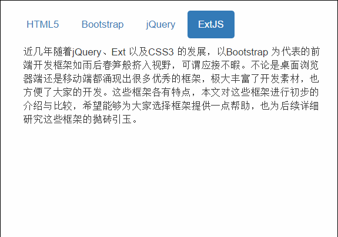
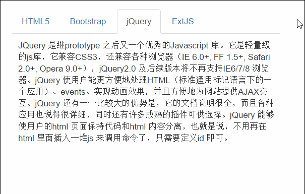

## 1.标签页 ##
标签页也就是通常所说的选项卡功能

	<ul class="nav nav-pills">
		<li class="active"><a href="#html5" data-toggle="tab">HTML5</a></li>
		<li><a href="#bootstrap" data-toggle="tab">Bootstrap</a></li>
		<li><a href="#jquery" data-toggle="tab">jQuery</a></li>
		<li><a href="#extjs" data-toggle="tab">ExtJS</a></li>
	</ul>
	

		
标准通用标记语言下的一个应用HTML 标准自1999 年12 月发布的HTML4.01后，后继的HTML5 和其它标准被束之高阁，为了推动Web 标准化运动的发展，一些公司联合起来，成立了一个叫做Web Hypertext Application Technology Working Group（Web 超文本应用技术工作组-WHATWG） 的组织。WHATWG 致力于Web 表单和应用程序，而W3C（World Wide Web Consortium，万维网联盟） 专注于XHTML2.0。在2006 年，双方决定进行合作，来创建一个新版本的HTML。

		
Bootstrap，来自Twitter，是目前很受欢迎的前端框架。Bootstrap 是基于HTML、CSS、JAVASCRIPT 的，它简洁灵活，使得Web 开发更加快捷。[1] 它由Twitter的设计师Mark Otto 和Jacob Thornton 合作开发，是一个CSS/HTML 框架。Bootstrap提供了优雅的HTML 和CSS 规范，它即是由动态CSS 语言Less 写成。Bootstrap 一经推出后颇受欢迎，一直是GitHub 上的热门开源项目，包括NASA 的MSNBC（微软全国广播公司）的Breaking News 都使用了该项目。[2] 国内一些移动开发者较为熟悉的框架，如WeX5前端开源框架等，也是基于Bootstrap 源码进行性能优化而来。[3] 

		
JQuery 是继prototype 之后又一个优秀的Javascript 库。它是轻量级的js库，它兼容CSS3，还兼容各种浏览器（IE 6.0+, FF 1.5+, Safari 2.0+, Opera 9.0+），jQuery2.0 及后续版本将不再支持IE6/7/8 浏览器。jQuery 使用户能更方便地处理HTML（标准通用标记语言下的一个应用）、events、实现动画效果，并且方便地为网站提供AJAX交互。jQuery 还有一个比较大的优势是，它的文档说明很全，而且各种应用也说得很详细，同时还有许多成熟的插件可供选择。jQuery 能够使用户的html 页面保持代码和html 内容分离，也就是说，不用再在html 里面插入一堆js 来调用命令了，只需要定义id 即可。

		
近几年随着jQuery、Ext 以及CSS3 的发展，以Bootstrap 为代表的前端开发框架如雨后春笋般挤入视野，可谓应接不暇。不论是桌面浏览器端还是移动端都涌现出很多优秀的框架，极大丰富了开发素材，也方便了大家的开发。这些框架各有特点，本文对这些框架进行初步的介绍与比较，希望能够为大家选择框架提供一点帮助，也为后续详细研究这些框架的抛砖引玉。
	
	

样式   

也可以使用脚本方式触发

	<ul class="nav nav-tabs" id="nav">
		<li class="active"><a href="#html5" >HTML5</a></li>
		<li><a href="#bootstrap">Bootstrap</a></li>
		<li><a href="#jquery" >jQuery</a></li>
		<li><a href="#extjs" >ExtJS</a></li>
	</ul>

	

样式 

