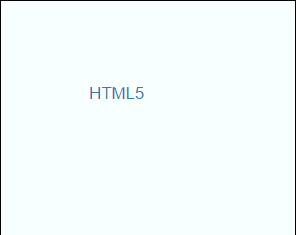
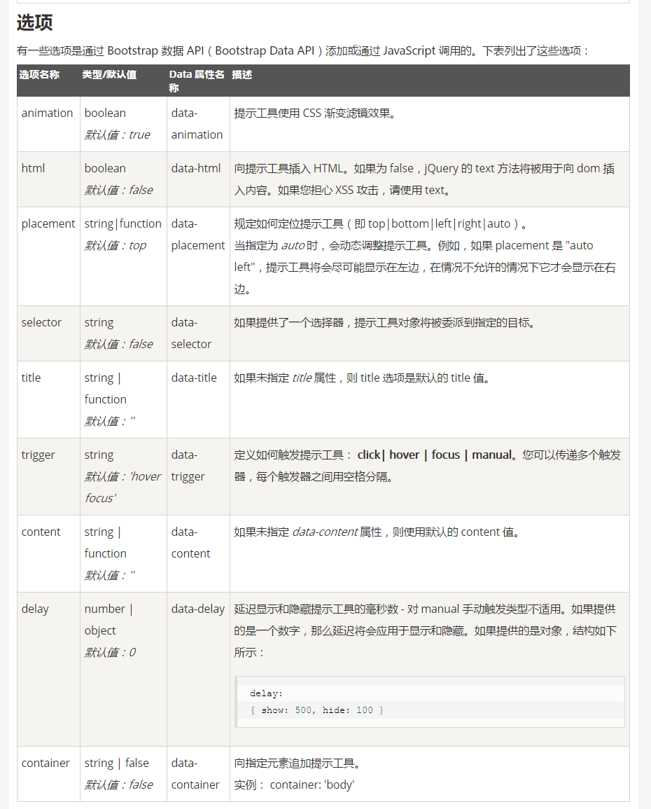

## 1工具提示 ##
工具提示就是在鼠标移动到特定的元素上时，显示相关的提示语

	<body style="margin: 100px;">
	<a href="#" 
		data-toggle="tooltip"
	 	title="超文本标识符"
	 	data-original-title="<b>超文本标识符</b>"
	 	data-html="true"
	 	data-animation="false"
	 	data-placement="left"
	 	data-trigger="click"
	 	data-delay="1000"
	>HTML5</a>

	

样式  

选项说明

