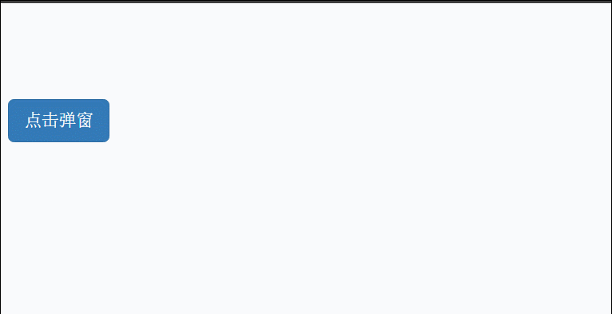
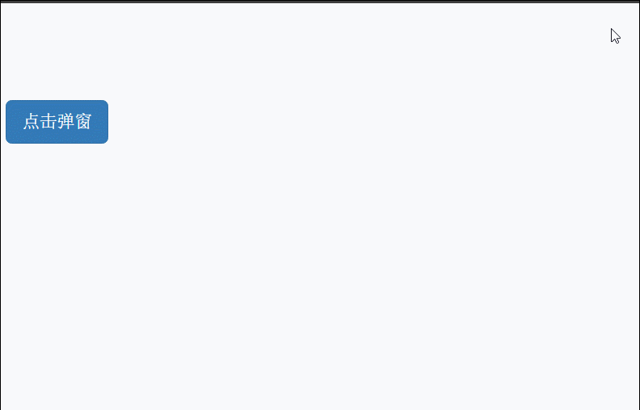
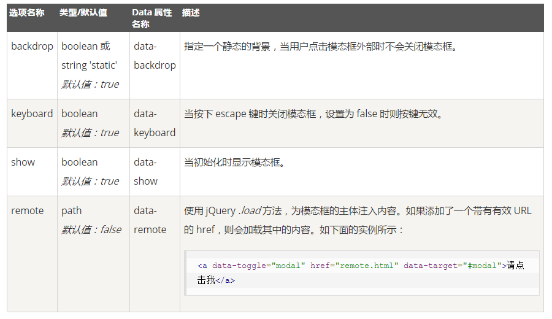
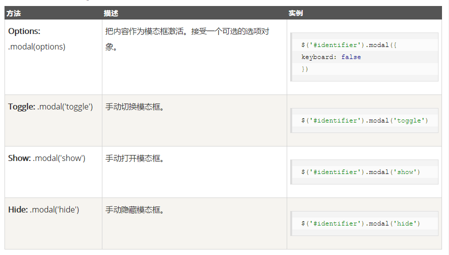

## 1.基本使用 ##
使用模态框组件需要三层div容器。分别为modal、dialog、content。在内容里面，还有三层，分别为header、body、footer.

	<!-- 模态框声明 -->
	

		<!-- 窗口声明 -->
		

			<!-- 内容声明 -->
			

				

					<button class="close" data-dismiss="modal">&times;</button>
					<h4>会员登录</h4>
				

				

					

						

							
1

							
2

							
3

						

					

				

				

					<button class="btn btn-default">注册</button>
					<button class="bn  btn-primary">登录</button>
				

			

		

	

	<button class="btn btn-primary btn-lg" data-toggle="modal" data-target="#myModal">点击弹窗</button>

也可以用jQuery设置。

	<button class="btn btn-primary btn-lg" id="btn">点击弹窗</button>
	

样式

设置淡入淡出效果的代码

	

在主体中使用栅格系统中的流体

	

		

			

				
1

				
2

				
3

			

		

	

data属性  
data-toggle  表示触发类型  
data-target  表示触发的节点

选项  

方法  

