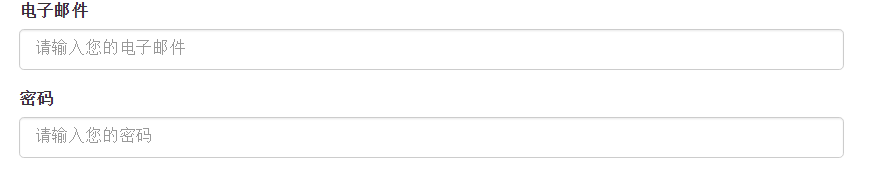
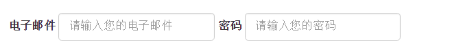
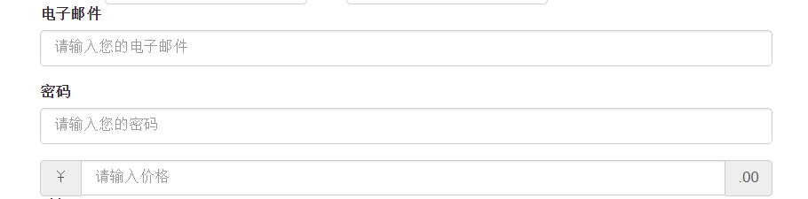
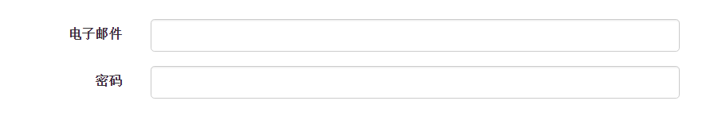
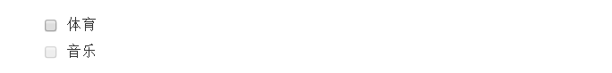
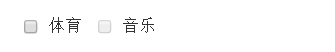
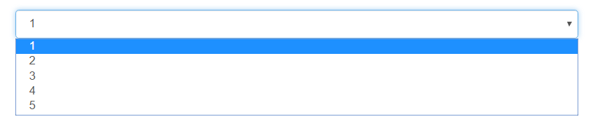
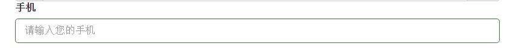
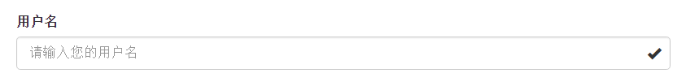

## 1.基本格式 ##

	<form action="">
		

			<label for="">电子邮件</label>
			<input type="email" class="form-control" placeholder="请输入您的电子邮件">
		

		

			<label for="">密码</label>
			<input type="password" class="form-control" placeholder="请输入您的密码">
		

	</form>
样式  

只有正确设置了输入框的type类型，才能被赋予正确的样式，支持的输入框组件包括text,password,datetime,datetime-local,date,month,time,week,number,email,url,search,tel,color.  
## 2.内联表单 ##

	<form action="" class="form-inline">
		

			<label for="">电子邮件</label>
			<input type="email" class="form-control" placeholder="请输入您的电子邮件">
		

		

			<label for="">密码</label>
			<input type="password" class="form-control" placeholder="请输入您的密码">
		

	</form>
样式：

注：当小于768px时，会回复独占样式
## 3.表单合组 ##

	<form action="">
		

			<label for="">电子邮件</label>
			<input type="email" class="form-control" placeholder="请输入您的电子邮件">
		

		

			<label for="">密码</label>
			<input type="password" class="form-control" placeholder="请输入您的密码">
		

		

			
￥

			<input type="text" class="form-control" placeholder="请输入价格">
			
.00

		

	</form>

样式：

    

## 4.水平排列 ##

	<form action="" class="form-horizontal">
		

			<label for="" class="col-sm-2 control-label">电子邮件</label>
			

				<input type="email" class="form-control">
			

		

		

			<label for="" class="col-sm-2 control-label">密码</label>
			

				<input type="password" class="form-control">
			

		

	</form>

样式：

  

contol-label表示和父元素样式同步

## 5.复选框和单选框 ##
常规复选框

	<form>	
		

			<label for="">
				<input type="checkbox">体育
			</label>
		

		

			<label for="">
				<input type="checkbox" disabled>音乐
			</label>
		

	</form>
样式：

内联复选框 

	<form>
		<label for="" class="checkbox-inline">
			<input type="checkbox">体育
		</label>
		<label for="" class="checkbox-inline disabled">
			<input type="checkbox" disabled>音乐
		</label>
	</form>

样式：  

## 6.下拉列表 ##

	<form action="">
		<select name="" id="" class="form-control">
			<option value="">1</option>
			<option value="">2</option>
			<option value="">3</option>
			<option value="">4</option>
			<option value="">5</option>
		</select>
	</form>
样式：  
   

7.校验状态

	<form>
		

			<label for="">手机</label>
			<input type="text" class="form-control" placeholder="请输入您的手机">
		

	</form>

样式：

还有其他状态如下

	has-success		成功状态
	has-error		成功状态
	has-warning		警告状态

## 8.添加额外的图标 ##

	<form>
		

			<label for="">用户名</label>
			<input type="text" class="form-control" placeholder="请输入您的用户名">
				
		

	</form>
样式如下：  
   

还有其他图标

	glyphicon-ok			成功状态
	glyphicon-warning-sign	警告状态
	glyphicon-remove		错误状态