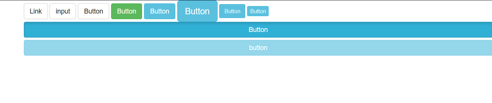

## 1.可作为按钮使用的标签或者元素 ##
转化成普通按钮

	<a href="xxx" class="btn btn-default">Link</a>
	<button class="btn btn-default">Button</button>
	<input type="button" class="btn btn-default" vlue="input">
注意事项  
1.针对组件的注意事项  
 虽然按钮类可以应用到a和button上，但是，导航和导航条组件只支持<button\>元素    
2.链接被作为按钮时的注意事项  
如果a元素被用作按钮使用，并用于在当前页面出发某些功能，而不是用于链接其他页面或者链接当前页面中的其他部分，那么，务必请设置role=“button”属性。    
3.跨浏览器展现  
强烈建议尽可能使用button元素来获得在各个浏览器上获得相匹配的绘制效果。

 
## 2.预设样式 ##

	btn-default    默认样式
	btn-success	   成功样式
	btn-info 	   一般信息样式
	btn-warning   警告样式
    btn-danger    危险样式
	btn-primary   首选项样式
	btn-link      链接样式

## 3.尺寸大小 ##
从大到小的尺寸

	<button class="btn btn-lg">Button</buttron>
	<button class="btn">Button</button>
	<button class="btn btn-sm">button</button>
	<button class="btn btn-xs">button</button>

## 4.块级按钮 ##
块级换行

	<button class="btn btn-block">Button</button>
## 5.激活状态 ##

	<button class="btn active">Button<button>

## 6.禁用状态 ##

	<button class="btn disabled">button<button>

## 7.源代码 ##

	<a href="###" class="btn btn-default">Link</a>
	<input type="button" class="btn btn-default" value="input">
	<button class="btn btn-default">Button</button>
	<button class="btn btn-success">Button</button>
	<button class="btn btn-info">Button</button>
	<button class="btn btn-info btn-lg">Button</button>
	<button class="btn btn-info btn-sm">Button</button>
	<button class="btn btn-info btn-xs">Button</button>
	<button class="btn btn-info btn-block active">Button</button>
	<button class="btn btn-info btn-block disabled">button</button>

## 8.样式 ##

