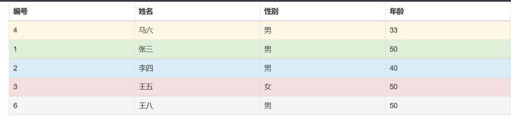

## 1.基本格式 ##

实现基本的表格样式

	<table class="table">

## 2.条纹状表格 ##
让tbody里产生一行隔一行加单色背景效果

	<table class="table table-striped">

注：表格效果需要基本格式.table
## 3.带边框的表格 ##
给表格增加边框

	<table class="table table-bordered">

## 4.悬停鼠标 ##
让tbody下的表格悬停鼠标实现背景效果

	<table class="table table-hover">
	
## 5.状态类 ##
可以单独设置每一行的背景样式

	<tr class="success">

注：一共有5种不同的样式可供选择

	active    鼠标悬停在行或者单元格上
	success   表示成功或积极的动作
	info	  表示普通的提示信息或动作
	warning	  表示警告或需要用户注意
	danger	  表示危险或者潜在的带来负面影响的动作

## 6.隐藏某一行 ##
	
	<tr class="sr-only">

## 7.响应式表格 ##

	<body class="table-responsive">

## 8.表格源代码 ##

	<table class="table table-striped table-bordered table-hover">
		<thead>
			<tr>
				<th>编号</th>
				<th>姓名</th>
				<th>性别</th>
				<th>年龄</th>
			</tr>
		</thead>
		<tbody>
			<tr class="success">
				<td>1</td>
				<td>张三</td>
				<td>男</td>
				<td>50</td>
			</tr>
			<tr class="info">
				<td>2</td>
				<td>李四</td>
				<td>男</td>
				<td>40</td>
			</tr>
			<tr class="danger">
				<td>3</td>
				<td>王五</td>
				<td>女</td>
				<td>50</td>
			</tr>
			<tr class="warning">
				<td>4</td>
				<td>马六</td>
				<td>男</td>
				<td>33</td>
			</tr>
			<tr class="sr-only">
				<td>5</td>
				<td>侯七</td>
				<td>男</td>
				<td>50</td>
			</tr>
			<tr class="active">
				<td>6</td>
				<td>王八</td>
				<td>男</td>
				<td>50</td>
			</tr>
		</tbody>
	</table>

## 9.表格显示样式 ##

