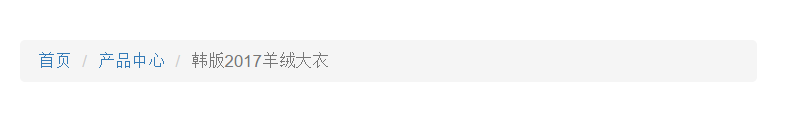
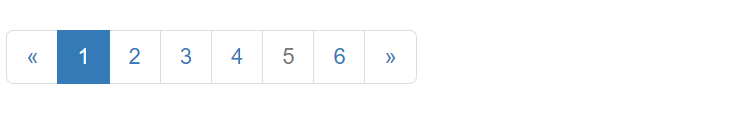
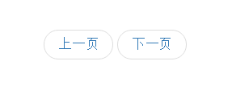
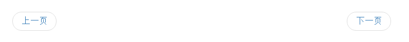
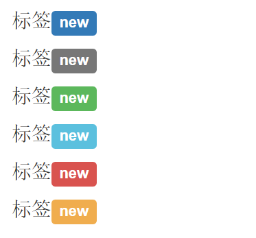
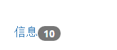
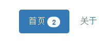

## 1.路径组件 ##
路径组件也叫面包屑组件

	<ol class="breadcrumb">
		<li><a href="#">首页</a></li>
		<li><a href="#">产品中心</a></li>
		<li class="active">韩版2017羊绒大衣</li>
	</ol>

样式  

## 2.分页组件 ##

	<ul class="pagination pagination-lg">
		<li><a href="#">&laquo;</a></li>
		<li class="active"><a href="#">1</a></li>
		<li><a href="#">2</a></li>
		<li><a href="#">3</a></li>
		<li><a href="#">4</a></li>
		<li class="disabled"><a href="#">5</a></li>
		<li><a href="#">6</a></li>
		<li><a href="#">&raquo;</a></li>
	</ul>

样式  

翻页效果  

	<ul class="pager">
		<li><a href="#">上一页</a></li>
		<li><a href="#">下一页</a></li>
	</ul>

样式  

对齐翻页

	<ul class="pager">
		<li class="previous"><a href="#">上一页</a></li>
		<li class="next"><a href="#">下一页</a></li>
	</ul>

样式  

## 3.标签 ##

	<h3>标签new</h3>
	<h3>标签new</h3>
	<h3>标签new</h3>
	<h3>标签new</h3>
	<h3>标签new</h3>
	<h3>标签new</h3>

样式

## 4.徽章 ##
未读信息数量徽章

	<a href="#">信息10</a>

样式  

按钮中使用徽章

	<button class="btn btn-success">
		提交10
	</button>

样式   

激活状态自动适配色调

	<ul class="nav nav-pills">
		<li class="active"><a href="#">首页2</a></li>
		<li><a href="#">关于</a></li>
	</ul>

样式

