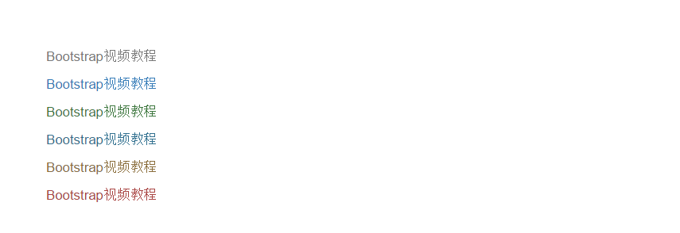
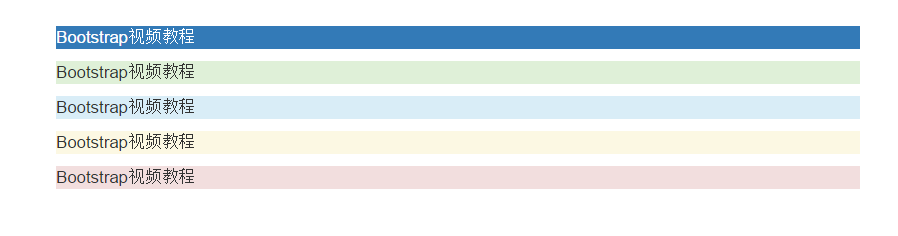
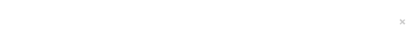
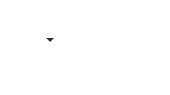
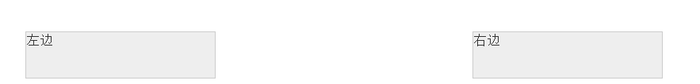
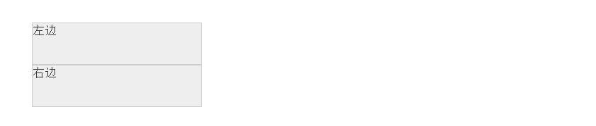
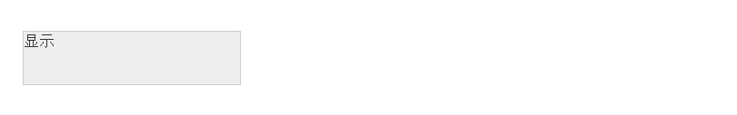

## 1.情景文本颜色 ##

	text-muted		柔和灰
	text-primary	主要蓝
	text-success	成功绿
	text-info		信息蓝
	text-warning	警告黄
	text-danger		危险红

代码：

	
Bootstrap视频教程

	
Bootstrap视频教程

	
Bootstrap视频教程

	
Bootstrap视频教程

	
Bootstrap视频教程

	
Bootstrap视频教程

样式：
 

## 2.情景背景色 ##

	bg-primary		主要蓝
	bg-success		成功绿	
	bg-info			信息蓝	
	bg-warning 		警告黄
	bg-danger		危险红

代码：

	
Bootstrap视频教程

	
Bootstrap视频教程

	
Bootstrap视频教程

	
Bootstrap视频教程

	
Bootstrap视频教程

样式：

## 3.关闭按钮 ##

	<button class="close">&times;</button>

样式：

## 4.三角符号 ##

	

## 5.快速浮动 ##

	
左边

	
右边

样式：

这个浮动其实就是float，只不过使用了!impoartant加强了优先级。
## 6.块级居中 ##

	
居中

样式：

## 7.清理浮动 ##

	
左边

	

	
右边

样式：

## 8.显示和隐藏 ##

	
显示

	
隐藏

样式：

