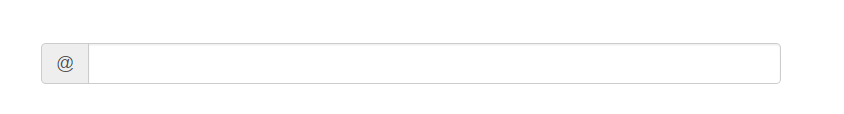
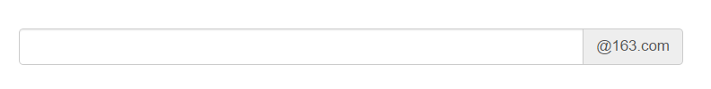
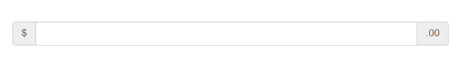
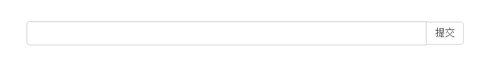
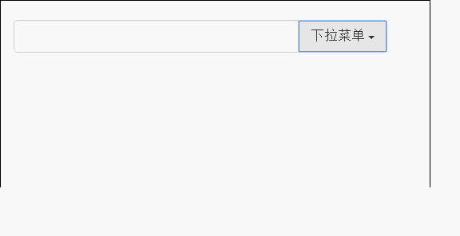

文本输入框就是可以在input元素前后加上文字或者按钮，可以实现对表单控件的扩展。  
## 往左侧添加文字 ##   

	

		@
		<input type="text" class="form-control">
	

样式

## 往右侧添加文字 ##  

	

		<input type="text" class="form-control">
		@163.com
	

样式

## 往两侧添加文字 ##

	

		$
		<input type="text" class="form-control">
		.00
	

样式

## 左侧使用复选框和单选框 ##

	

		
			<input type="checkbox">
		
		<input type="text" class="form-control">
	

样式

## 右侧使用按钮 ##

	

		<input type="text" class="form-control">
		

			<button class="btn btn-default">提交</button>
		

	

样式   

## 使用下拉菜单或分列式 ##

	

		<input type="text" class="form-control">
		

			<button class="btn btn-default" data-toggle="dropdown">
				下拉菜单
				
			</button>
			<ul class="dropdown-menu">
				<li class="dropdown-header">网站导航</li>
				<li><a href="#">首页</a></li>
				<li><a href="#">资讯</a></li>
				<li><a href="#">产品</a></li>
				<li class="divider"><a href="#">产品</a></li>
				<li class="disabled"><a href="#">关于</a></li>
			</ul>
		

	

样式   
