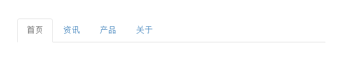
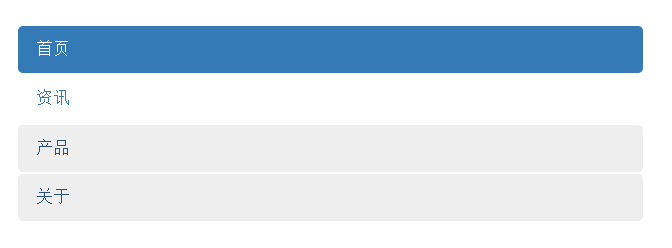
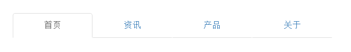
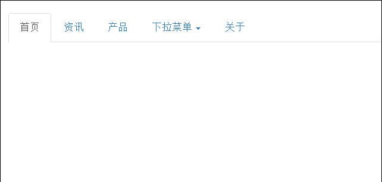

boostrap提供了一组导航组件，用于实现web页面的栏目操作。
## 1.基本导航标签页 ##

	<ul class="nav nav-tabs">
		<li class="active"><a href="#">首页</a></li>
		<li><a href="#">资讯</a></li>
		<li><a href="#">产品</a></li>
		<li><a href="#">关于</a></li>
	</ul>

样式

## 2.胶囊式导航 ##

	<ul class="nav nav-pills">
		<li class="active"><a href="#">首页</a></li>
		<li><a href="#">资讯</a></li>
		<li><a href="#">产品</a></li>
		<li><a href="#">关于</a></li>
	</ul>

样式  

## 3.垂直胶囊式导航 ##

	<ul class="nav nav-pills nav-stacked">
		<li class="active"><a href="#">首页</a></li>
		<li><a href="#">资讯</a></li>
		<li><a href="#">产品</a></li>
		<li><a href="#">关于</a></li>
	</ul>

样式  

## 4.导航两端对齐 ##  

	<ul class="nav nav-tabs nav-justified">
		<li class="active"><a href="#">首页</a></li>
		<li><a href="#">资讯</a></li>
		<li><a href="#">产品</a></li>
		<li><a href="#">关于</a></li>
	</ul>

## 带下拉菜单的导航  ##

	<ul class="nav nav-tabs">
		<li class="active"><a href="#">首页</a></li>
		<li><a href="#">资讯</a></li>
		<li><a href="#">产品</a></li>
		<li class="dropdown">
			<a href="#" data-toggle="dropdown">下拉菜单
				
			</a>
			<ul class="dropdown-menu">
				<li><a href="#">首页</a></li>
				<li><a href="#">资讯</a></li>
				<li><a href="#">产品</a></li>
				<li><a href="#">关于</a></li>
			</ul>
		</li>
		<li><a href="#">关于</a></li>
	</ul>

样式    

