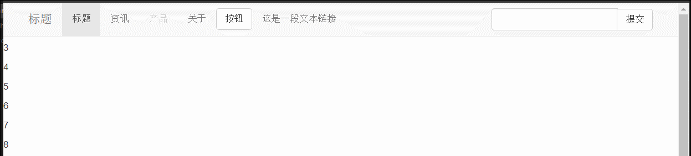

## 1.基本格式 ##

	<nav class="navbar navbar-default navbar-fixed-top">
		

			

				<a href="#" class="navbar-brand">标题</a>
			

			<ul class="nav navbar-nav">
				<li class="active"><a href="#">标题</a></li>
				<li><a href="#">资讯</a></li>
				<li class="disabled"><a href="#">产品</a></li>
				<li><a href="#">关于</a></li>
			</ul>
			<form action="" class="navbar-form navbar-right">
				

					<input type="text" class="form-control">
					

						<button class="btn btn-default">提交</button>
					

				

			</form>
			<button class="btn btn-default navbar-btn navbar-left">按钮</button>
			
这是一段文本<a href="#" class="navbar-link">链接</a>

		

	</nav>
## 2.反色调导航 ##  

	<nav class="navbar navbar-inverse">
	...
	</nav>

## 3.导航中使用按钮以及使用对齐方式 ##

	<button class="btn btn-default navbar-btn navbar-left">按钮</button>

## 4.导航中使用文本和链接 ##

	
这是一段文本<a href="#" class="navbar-link">链接</a>

将导航固定在顶部

	<nav class="navbar navbar-default navbar-fixed-top">

样式

