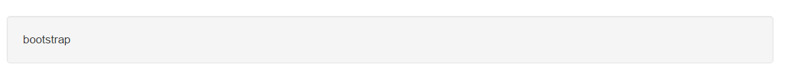
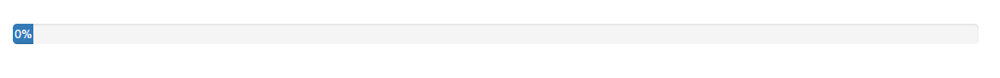
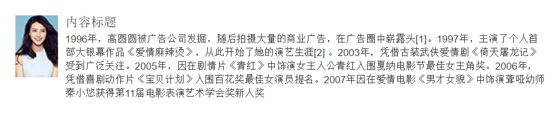

## 1.well组件 ##
这个组件可以实现简单的嵌套效果

	

		bootstrap
	

样式  

## 2.进度条组件 ##
进度条组件为当前工作流程或动作提供时时反馈  
基本进度条

	

		
60%

	

样式  

最低值进度条  

	

		
0%

	

样式  

结合情景的进度条

	

		
60%

	

样式  

条纹状

	

		
60%

	

样式  

动画效果

	

		
60%

	

样式  

堆叠效果

	

		
20%

		
40%

		
40%

	

样式  

## 3.媒体对象组件 ##
媒体对象可以包含图片，视频或者音频等媒体，以达到对象和文本组合显示的样式效果。

	

		

			
		

		

			<h4 class="media-heading">内容标题</h4>
			
1996年，高圆圆被广告公司发掘，随后拍摄大量的商业广告，在广告圈中崭露头[1]。1997年，主演了个人首部大银幕作品《爱情麻辣烫》，从此开始了她的演艺生涯[2]  。2003年，凭借古装武侠爱情剧《倚天屠龙记》受到广泛关注。2005年，因在剧情片《青红》中饰演女主人公青红入围戛纳电影节最佳女主角奖。2006年，凭借喜剧动作片《宝贝计划》入围百花奖最佳女演员提名。2007年因在爱情电影《男才女貌》中饰演聋哑幼师秦小悠获得第11届电影表演艺术学会奖新人奖 

		

	

样式  

 

媒体对象列表

	<ul class="media-list">
		<li class="media">
			

				
			

			

				<h4 class="media-heading">内容标题</h4>
				
1996年，高圆圆被广告公司发掘，随后拍摄大量的商业广告，在广告圈中崭露头[1]。1997年，主演了个人首部大银幕作品《爱情麻辣烫》，从此开始了她的演艺生涯[2]  。2003年，凭借古装武侠爱情剧《倚天屠龙记》受到广泛关注。2005年，因在剧情片《青红》中饰演女主人公青红入围戛纳电影节最佳女主角奖。2006年，凭借喜剧动作片《宝贝计划》入围百花奖最佳女演员提名。2007年因在爱情电影《男才女貌》中饰演聋哑幼师秦小悠获得第11届电影表演艺术学会奖新人奖 

			

		</li>
		<li class="media">
			

				
			

			

				<h4 class="media-heading">内容标题</h4>
				
1996年，高圆圆被广告公司发掘，随后拍摄大量的商业广告，在广告圈中崭露头[1]。1997年，主演了个人首部大银幕作品《爱情麻辣烫》，从此开始了她的演艺生涯[2]  。2003年，凭借古装武侠爱情剧《倚天屠龙记》受到广泛关注。2005年，因在剧情片《青红》中饰演女主人公青红入围戛纳电影节最佳女主角奖。2006年，凭借喜剧动作片《宝贝计划》入围百花奖最佳女演员提名。2007年因在爱情电影《男才女貌》中饰演聋哑幼师秦小悠获得第11届电影表演艺术学会奖新人奖 

				

					

						
					

					

						<h4 class="media-heading">内容标题</h4>
						
1996年，高圆圆被广告公司发掘，随后拍摄大量的商业广告，在广告圈中崭露头[1]。1997年，主演了个人首部大银幕作品《爱情麻辣烫》，从此开始了她的演艺生涯[2]  。2003年，凭借古装武侠爱情剧《倚天屠龙记》受到广泛关注。2005年，因在剧情片《青红》中饰演女主人公青红入围戛纳电影节最佳女主角奖。2006年，凭借喜剧动作片《宝贝计划》入围百花奖最佳女演员提名。2007年因在爱情电影《男才女貌》中饰演聋哑幼师秦小悠获得第11届电影表演艺术学会奖新人奖 

					

				

				

					

						
					

					

						<h4 class="media-heading">内容标题</h4>
						
1996年，高圆圆被广告公司发掘，随后拍摄大量的商业广告，在广告圈中崭露头[1]。1997年，主演了个人首部大银幕作品《爱情麻辣烫》，从此开始了她的演艺生涯[2]  。2003年，凭借古装武侠爱情剧《倚天屠龙记》受到广泛关注。2005年，因在剧情片《青红》中饰演女主人公青红入围戛纳电影节最佳女主角奖。2006年，凭借喜剧动作片《宝贝计划》入围百花奖最佳女演员提名。2007年因在爱情电影《男才女貌》中饰演聋哑幼师秦小悠获得第11届电影表演艺术学会奖新人奖 

					

				

				

					

						
					

					

						<h4 class="media-heading">内容标题</h4>
						
1996年，高圆圆被广告公司发掘，随后拍摄大量的商业广告，在广告圈中崭露头[1]。1997年，主演了个人首部大银幕作品《爱情麻辣烫》，从此开始了她的演艺生涯[2]  。2003年，凭借古装武侠爱情剧《倚天屠龙记》受到广泛关注。2005年，因在剧情片《青红》中饰演女主人公青红入围戛纳电影节最佳女主角奖。2006年，凭借喜剧动作片《宝贝计划》入围百花奖最佳女演员提名。2007年因在爱情电影《男才女貌》中饰演聋哑幼师秦小悠获得第11届电影表演艺术学会奖新人奖 

					

				

			

		</li>
	</ul>

样式  
