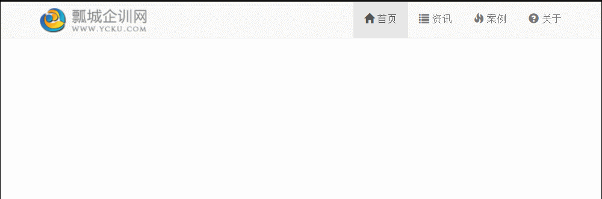

## 响应式导航条 ##

	<nav class="navbar navbar-default navbar-fixed-top">
		

			

				
				<button type="button" class="navbar-toggle" data-toggle="collapse" data-target="#navbar-collapse">
					
					
					
				</button>
			

			

				<ul class="nav navbar-nav navbar-right" style="margin-top: 0;">
					<li class="active"><a href="#"> 首页</a></li>
					<li><a href="#"> 资讯</a></li>
					<li><a href="#"> 案例</a></li>
					<li><a href="#"> 关于</a></li>
				</ul>
			

		

	</nav>

样式  
